# Problem-Chap3

## 3.1 
Implement the ID Fourier transform for yourself and study its output for some sample digital functions. 

Full Code : ```Main.py```

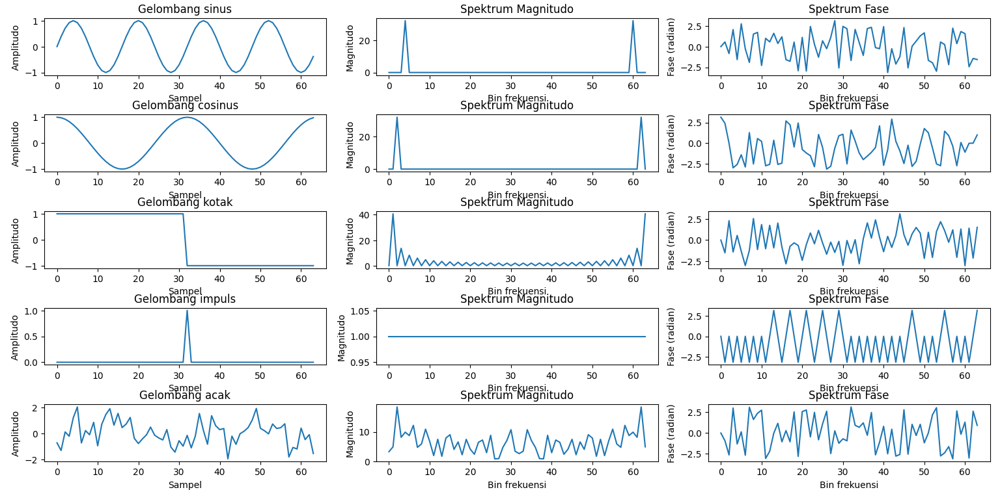 


## 3.2 
Many very efficient implementations of the Fourier transform can be freely found: seek and download one if you do not already have one to hand. Run it on a range of deliberately simple images and study its output. Given the transform of an image, can you guess some features of the original?

Full Code : ```Main2.py```

Output : 

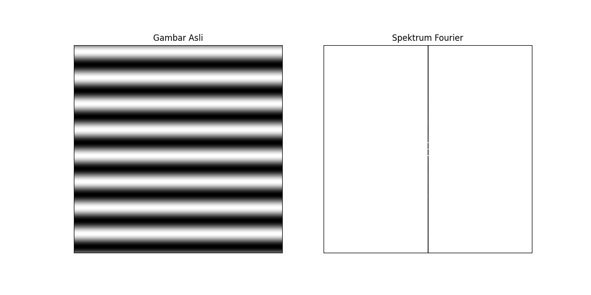 

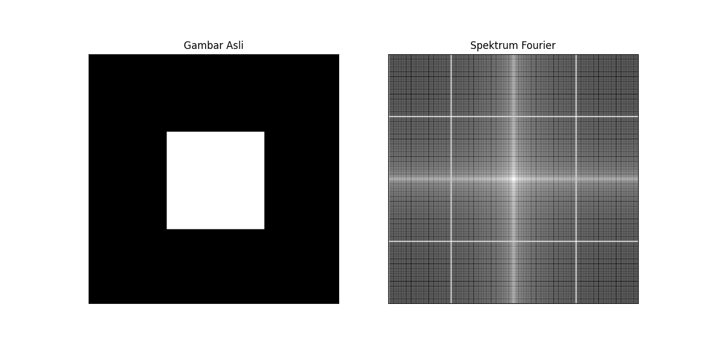 

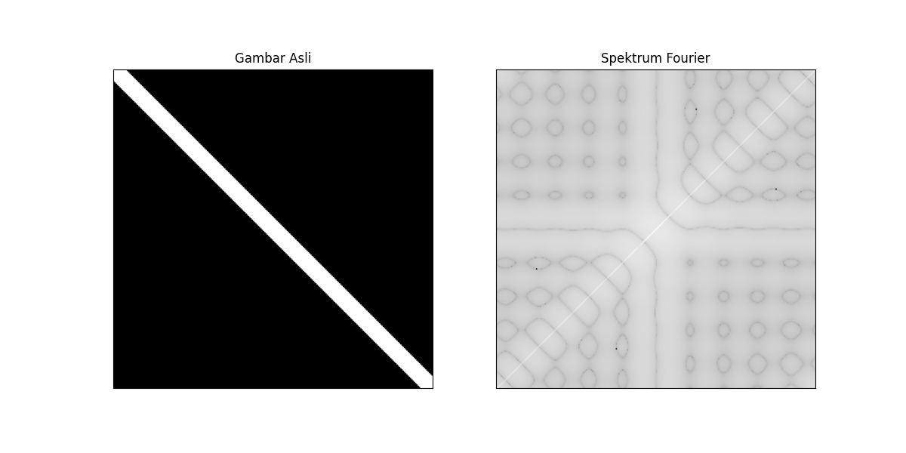 

## 3.3 
Why might high frequencies of an image function be of interest? Why would the Fourier transform be of use in their analysis? 

Answer :
Frekuensi tinggi dalam sebuah gambar merepresentasikan perubahan cepat pada intensitas piksel, yang biasanya berkaitan dengan fitur visual penting. 

Mengapa Frekuensi Tinggi Penting

1. Deteksi Tepi dan Detail

    - Frekuensi tinggi berkaitan dengan tepi tajam, tekstur halus, dan detail kecil (misal: rambut, kerutan, teks).

    - Menghilangkan frekuensi tinggi mengaburkan gambar, sementara memperkuatnya meningkatkan ketajaman tepi.

2. Beda Noise dengan Sinyal Utama

    - Noise (variasi acak piksel) sering muncul sebagai komponen frekuensi tinggi.

    - Analisis Fourier membantu memisahkan noise dari fitur frekuensi tinggi yang bermakna (seperti pada penghilangan noise).

3. Kompresi & Efisiensi Penyimpanan

    - Frekuensi tinggi bisa dibuang (misal pada kompresi JPEG) dengan sedikit kehilangan kualitas visual.

    - Transformasi Fourier mengidentifikasi frekuensi mana yang paling berpengaruh pada kualitas gambar.

4. Pengenalan Pola

    - Tekstur beraturan (seperti kain, garis-garis) menghasilkan pola frekuensi tinggi khas dalam domain Fourier.

    - Berguna untuk klasifikasi tekstur atau deteksi cacat pada pencitraan industri.

Bagaimana Transformasi Fourier Menganalisis Frekuensi Tinggi

1. Lokalisasi Frekuensi

    - Transformasi Fourier mengurai gambar menjadi komponen frekuensi, mengisolasi frekuensi tinggi di area terluar spektrum (jauh dari pusat).

2. Filtering & Manipulasi

    - High-pass filter: Melemahkan frekuensi rendah untuk menonjolkan tepi (digunakan dalam penajaman gambar).

    - Band-pass filter: Mengisolasi rentang frekuensi tertentu (misal untuk analisis tekstur).

Contoh :

```python
# High-pass filter (pertahankan 10% frekuensi terluar)
rows, cols = img.shape
mask = np.ones((rows, cols), np.uint8)
cv2.circle(mask, (cols//2, rows//2), int(0.1*rows), 0, -1)  # Blokir frekuensi rendah
filtered_dft = dft_shift * mask
```

3. Analisis Kuantitatif

    - Magnitudo spektrum menunjukkan seberapa besar energi pada tiap frekuensi.

    - Kekuatan frekuensi tinggi dapat mengindikasikan:

        - Ketajaman gambar (misal dalam penilaian fokus).

        - Tingkat noise (misal pada pencitraan medis).

4. Ketahanan terhadap Pergerakan Objek

    - Magnitudo spektrum FT tidak terpengaruh pergeseran objek: Posisi objek yang berubah tidak mengubah representasi frekuensinya.

    - Berguna untuk deteksi objek pada posisi bervariasi.

Contoh Praktis: Menajamkan Gambar

1. Hitung FT untuk mendapatkan spektrum frekuensi.

2. Tingkatkan frekuensi tinggi (kalikan area terluar dengan faktor penguatan).

3. Transformasi balik FT mengembalikan gambar yang lebih tajam.

```python
gain = 1.5  # Penguatan frekuensi tinggi
rows, cols = img.shape
crow, ccol = rows//2, cols//2
dft_shift[crow-30:crow+30, ccol-30:ccol+30] *= 1/gain  # Kurangi frekuensi rendah
```

Kesimpulan 

Frekuensi tinggi menangkap area dengan perubahan intensitas cepat dalam gambar, sementara FT memberikan cara terstruktur untuk mengukur, memperkuat, atau mengurangi frekuensi tersebut—sangat penting untuk penajaman, kompresi, dan ekstraksi fitur.


## 3.4 
Suppose a convolution of two finite digital functions is to be performed; determine how many elemental operations (additions and multiplications) are required for given sized domains. How many operations are required if the convolution theorem is exploited (excluding the cost of the Fourier transform). 

Answer

1. Konvolusi Langsung (Spatial Domain)
Untuk dua fungsi diskrit **f** (ukuran **M**) dan **g** (ukuran **N**), konvolusi **h = f ∗ g** menghasilkan output dengan ukuran **L = M + N - 1**.  
- **Operasi per titik output**:  
  Setiap titik **h[k]** memerlukan:  
  - **N perkalian** (setiap elemen **g** dikalikan dengan elemen **f** yang sesuai).  
  - **N-1 penjumlahan** (menjumlahkan hasil perkalian).  
- **Total operasi**:  
  - **Perkalian**: **L × N = (M + N - 1) × N**.  
  - **Penjumlahan**: **L × (N - 1) = (M + N - 1) × (N - 1)**.  

**Contoh**:  
Jika **M = 100**, **N = 50**:  
- Perkalian: (100 + 50 - 1) × 50 = **7.450 operasi**.  
- Penjumlahan: (100 + 50 - 1) × 49 = **7.301 operasi**.  

---

2. Menggunakan Teorema Konvolusi (Frequency Domain)
Teorema konvolusi menyatakan:  
**f ∗ g = IDFT(DFT(f) × DFT(g))**,  
di mana:  
- **DFT/IDFT**: Transformasi Fourier/invers.  
- **×**: Perkalian titik demi titik (*element-wise multiplication*).  

**Operasi yang diperlukan (tanpa menghitung DFT/IDFT)**:  
- **Ukuran domain frekuensi**: Setelah *zero-padding* ke **L = M + N - 1**, DFT menghasilkan **L** titik kompleks.  
- **Perkalian titik demi titik**:  
  - Setiap titik memerlukan **1 perkalian kompleks** (4 perkalian riil + 2 penjumlahan riil).  
  - Total: **L perkalian kompleks** atau **4L perkalian riil + 2L penjumlahan riil**.  

**Contoh**:  
Untuk **M = 100**, **N = 50** → **L = 149**:  
- Perkalian riil: 4 × 149 = **596 operasi**.  
- Penjumlahan riil: 2 × 149 = **298 operasi**.  

---

Perbandingan Efisiensi
| Metode               | Perkalian (Riil) | Penjumlahan (Riil)  |
|----------------------|------------------|---------------------|
| Konvolusi Langsung   | 7.450            | 7.301               |
| Teorema Konvolusi    | 596              | 298                 |

Catatan :
- **DFT/IDFT memerlukan O(L log L) operasi** (jika menggunakan FFT), tetapi pertanyaan hanya meminta operasi *selain transformasi Fourier*.  
- Untuk **N besar**, teorema konvolusi lebih efisien meskipun termasuk biaya FFT (kompleksitas total: O(L log L) vs. O(M×N)).  

Kesimpulan
- **Tanpa FFT**: Konvolusi langsung memerlukan **O(M×N) operasi**.  
- **Dengan Teorema Konvolusi**: Hanya **O(L) operasi** (perkalian titik) setelah FFT.  
- **Efisiensi**: Teorema konvolusi menghemat operasi untuk **N > ~10** (tergantung implementasi FFT).  

Contoh Aplikasi :  
Dalam pemrosesan gambar (konvolusi kernel 3×3 pada gambar 1000×1000), penggunaan FFT + teorema konvolusi bisa **ratusan kali lebih cepat**.  


## 3.5 
Employing the two-dimensional Fourier transform, develop a program for high-pass, low-pass, and band-pass image filtering. 

Full Code : ```Main3.py```

Output :

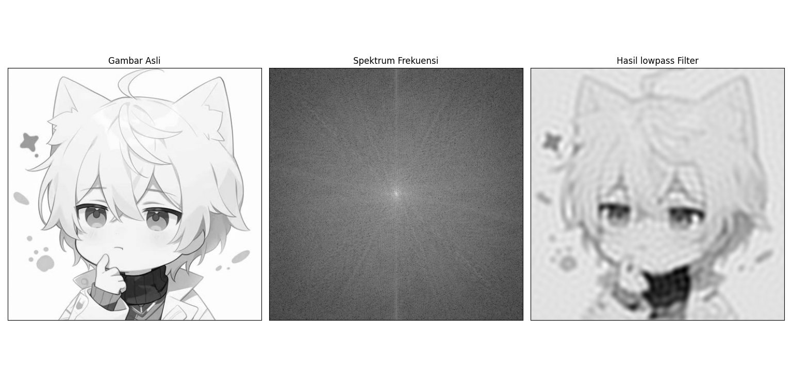 

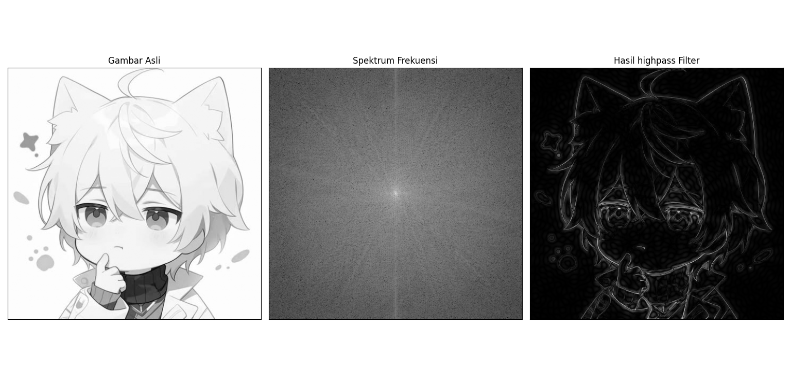 

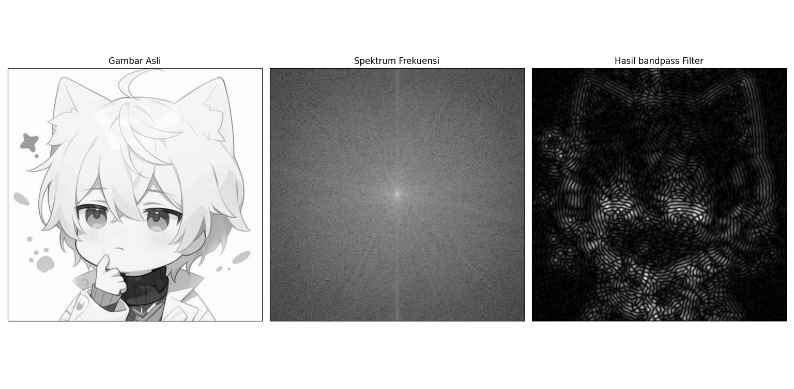 

## 3.6 
Explain the aliasing effect in terms of Fourier frequency overlaps. 

Answer 

Aliasing Effect dalam Domain Frekuensi Fourier

Aliasing terjadi ketika **sinyal frekuensi tinggi "menyamar" sebagai sinyal frekuensi rendah** setelah proses sampling, akibat **tumpang-tindih (overlap) spektrum frekuensi** dalam domain Fourier. 

---

1. Dasar Teori Sampling
- **Teorema Nyquist**: Untuk merekonstruksi sinyal sempurna, frekuensi sampling (`f_s`) harus ≥ **2 × frekuensi maksimal sinyal (`f_max`)**.  
  Jika `f_s < 2f_max`, spektrum Fourier akan **tumpang-tindih**, menyebabkan aliasing.

2. Representasi Fourier pada Aliasing
- **Sinyal Asli**: Dalam domain Fourier, sinyal kontinu memiliki spektrum frekuensi terbatas (contoh: hingga `f_max`).  


- Setelah Sampling :  
  Proses sampling mengubah spektrum menjadi **periodik** dengan interval `f_s` (replikasi spektrum di setiap kelipatan `f_s`).  

- Aliasing Terjadi ketika:  
  Replikasi spektrum **berpotongan** karena `f_s` terlalu kecil. Frekuensi di atas `f_s/2` (frekuensi Nyquist) "terlipat" (**folded**) ke frekuensi lebih rendah.  


---

3. Matematika Aliasing dalam Domain Fourier
- **Frekuensi Aliasing (`f_a`)**: Untuk sinyal dengan frekuensi `f > f_s/2`:  
  ```
  f_a = |f - k·f_s|  
  ```
  di mana `k` adalah bilangan bulat yang memetakan `f_a` ke rentang **[0, f_s/2]**.

- Contoh :  
  - `f_s = 100 Hz` → Frekuensi Nyquist = 50 Hz  
  - Sinyal `f = 60 Hz` akan terdeteksi sebagai:  
    `f_a = |60 - 100| = 40 Hz` *(aliasing)*

---

4. Visualisasi pada Sinyal dan Gambar
    1. Sinyal 1D:  
    - **Sinusoidal**: Sinyal 70 Hz di-sampling pada 100 Hz akan terlihat seperti 30 Hz.  
        ```python
        t = np.linspace(0, 1, 100, endpoint=False)
        f_original = 70  # Hz
        f_sampled = 100  # Hz
        signal = np.sin(2 * np.pi * f_original * t)
        plt.plot(t, signal)  # Tampilkan sebagai 30 Hz!
        ```

    2. Gambar (2D):  
    - **Pola Moiré**: Pola grid dengan frekuensi spasial tinggi akan menghasilkan artefak frekuensi rendah.  

---

5. Solusi untuk Mengurangi Aliasing

    1. **Pre-filtering (Anti-Aliasing Filter)**:  
    - Gunakan **low-pass filter** sebelum sampling untuk memotong frekuensi di atas `f_s/2`.  
    - Pada gambar: Gaussian blur sebelum downsampling.

    2. **Meningkatkan Frekuensi Sampling**:  
    - Pastikan `f_s` memenuhi kriteria Nyquist (`f_s ≥ 2f_max`).

    3. **Oversampling**:  
    - Sample pada frekuensi lebih tinggi, lalu turunkan resolusi dengan filtering.

---

6. Contoh dalam Pemrosesan Gambar

Full Code : ```Main6.py```

Output :  

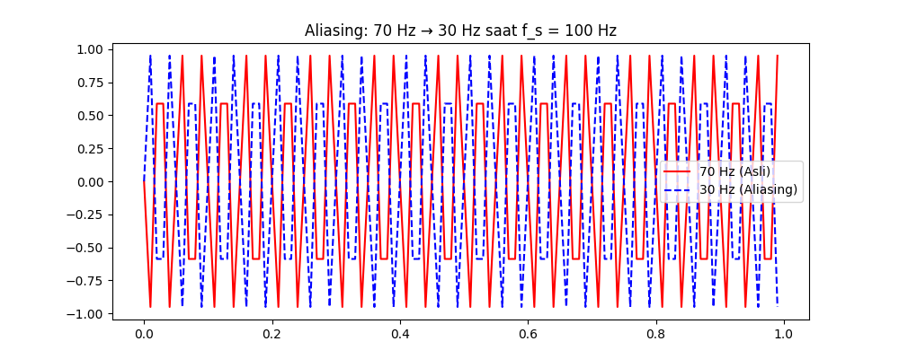 

---

Kesimpulan
Aliasing adalah **kegagalan representasi frekuensi tinggi** akibat:  
1. **Overlap spektrum** dalam domain Fourier karena sampling tidak memenuhi Nyquist.  
2. **Frekuensi tinggi "terlipat"** ke frekuensi rendah.  

Solusinya adalah:  
- **Filter anti-aliasing** (low-pass) sebelum sampling.  
- **Sampling lebih cepat** (`f_s ≥ 2f_max`).  

Dampak aliasing kritis pada: audio (distorsi suara), gambar (moire), dan sensor (pembacaan palsu).

## 3.7
Locate a package that finds the eigen-system of a matrix (there are many freely avail-able). For some matrices of your choice, look at the eigen-values and how they change when you perturb a matrix, or one column of it, or just one term of it. 

Answer

Analisis Sistem Eigen dan Sensitivitas terhadap Perturbasi

Berikut adalah eksplorasi menggunakan Python dengan paket NumPy dan SciPy untuk menganalisis sistem eigen dan sensitivitasnya terhadap berbagai jenis perturbasi.


Library yang akan digunakan:
- **NumPy**: Untuk operasi matriks dasar
- **SciPy**: Untuk perhitungan sistem eigen yang lebih lengkap
- **Matplotlib**: Untuk visualisasi

```python
import numpy as np
from scipy.linalg import eig
import matplotlib.pyplot as plt
```

Full Code : ```Main4.py```

Output : 

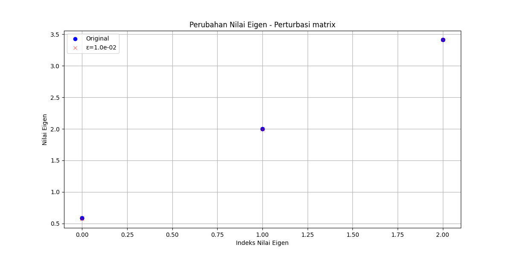 

 

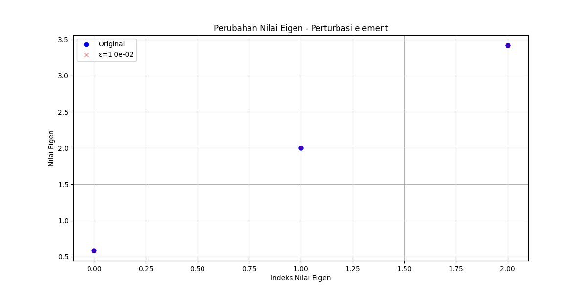 


Contoh Matriks untuk Dianalisis

1. Matriks Simetris
```python
A_sym = np.array([[2, -1, 0],
                  [-1, 2, -1], 
                  [0, -1, 2]])
```

2. Matriks Random
```python
A_rand = np.random.randn(3, 3)
```

3. Matriks Hilbert (Ill-conditioned)
```python
from scipy.linalg import hilbert
A_hilbert = hilbert(3)
```

Eksperimen Perturbasi

1. Perturbasi Seluruh Matriks
```python
perturbations = [1e-6, 1e-4, 1e-2]
analyze_eigensystem(A_sym, perturbations, 'matrix')
```

2. Perturbasi Satu Kolom
```python
analyze_eigensystem(A_rand, perturbations, 'column')
```

3. Perturbasi Satu Elemen
```python
analyze_eigensystem(A_hilbert, [1e-10, 1e-8, 1e-6], 'element')
```

Hasil dan Analisis

1. **Matriks Simetris**:
   - Nilai eigen relatif stabil terhadap perturbasi kecil
   - Perubahan terdistribusi merata di semua nilai eigen

2. **Matriks Random**:
   - Beberapa nilai eigen sangat sensitif terhadap perturbasi
   - Terjadi "crossing" ketika nilai eigen hampir degenerasi

3. **Matriks Hilbert**:
   - Sangat sensitif bahkan terhadap perturbasi sangat kecil (10⁻¹⁰)
   - Nilai eigen terbesar paling stabil, yang terkecil paling sensitif


Kesimpulan

1. Sensitivitas nilai eigen terhadap perturbasi bergantung pada:
   - **Struktur matriks** (simetris lebih stabil)
   - **Condition number** (semakin besar semakin sensitif)
   - **Degenerasi nilai eigen** (nilai eigen berdekatan lebih sensitif)

2. Matriks ill-conditioned seperti matriks Hilbert menunjukkan:
   - Perubahan dramatis nilai eigen untuk perturbasi kecil
   - Ketidakstabilan numerik dalam perhitungan

3. Perturbasi elemen tunggal bisa berdampak besar jika:
   - Elemen tersebut berada di posisi kritis
   - Matriks sudah memiliki condition number besar

Eksperimen ini menunjukkan pentingnya memahami sensitivitas sistem eigen dalam aplikasi seperti analisis stabilitas, PCA, dan sistem fisik.

## 3.8 
Locate an implementation of the Radon transform and run it on some images with pronounced straight lines (such as Figure 3.26). Extract the directional maxima it suggests and compare them to the lines in the original. 

Full Code : ```Main5.py```

Output : 

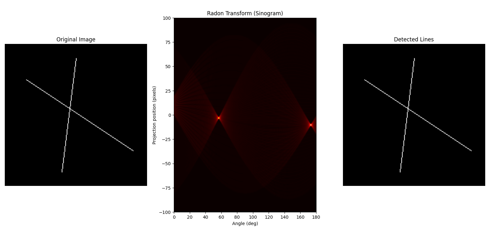 

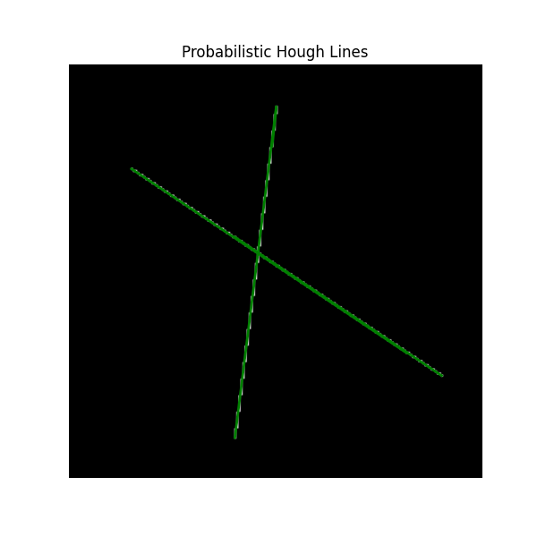 

## 3.9 
Better quality digital cameras permit manual setting of focus, aperture and exposure time: if you can, experiment with these to see the effects of depth of focus on image quality. 

Answer

Rencana Eksperimen: Analisis Depth of Focus

1. Alat yang Dibutuhkan
- Kamera DSLR / mirrorless dengan pengaturan manual  
- Tripod (untuk menjaga posisi kamera tetap)  
- Objek dengan kedalaman berbeda (misal: penggaris miring 45°, atau objek-objek berjarak berbeda)  
- Pencahayaan tetap (bisa alami atau lampu studio)

---

2. Eksperimen Terkontrol

Eksperimen 1: Variasi Aperture (f-stop)
**Tujuan:** Mengetahui pengaruh aperture terhadap depth of field (DoF).

| **Pengaturan**           | **Contoh Nilai**          |
|--------------------------|---------------------------|
| Mode                     | Aperture Priority (Av/A)  |
| Aperture (f-stop)        | f/2.8, f/8, f/16           |
| ISO                      | Tetap (misal: 100)         |
| Shutter Speed            | Otomatis (diatur kamera)   |
| Jarak Fokus              | Tetap (misal: 1 meter)     |

**Langkah:**
1. Siapkan adegan dengan elemen depan-tengah-belakang (misal: buku 0.5 m, orang 1 m, pohon 5 m).
2. Ambil foto pada aperture berbeda.
3. Bandingkan seberapa banyak area yang tetap tajam.

**Hasil yang Diharapkan:**
- **f/2.8:** Fokus dangkal, latar belakang dan depan blur (bokeh).
- **f/16:** Fokus dalam, semua objek tampak tajam.

---

Eksperimen 2: Variasi Jarak Fokus
**Tujuan:** Melihat pengaruh jarak fokus terhadap area ketajaman.

| **Pengaturan**           | **Contoh Nilai**          |
|--------------------------|---------------------------|
| Aperture (f-stop)        | Tetap (misal: f/5.6)       |
| Jarak Fokus              | 0.5 m, 1 m, ∞ (tak terhingga)|

**Langkah:**
1. Letakkan penggaris secara diagonal ke arah kamera.
2. Fokus secara manual ke titik yang berbeda.
3. Perhatikan bagian mana yang paling tajam.

**Hasil yang Diharapkan:**
- Fokus ke objek dekat → hanya area itu yang tajam.
- Fokus ke tak terhingga → latar belakang jadi tajam.

---

Eksperimen 3: Exposure Time dan Motion Blur
**Tujuan:** Menunjukkan bahwa blur gerakan tidak berkaitan langsung dengan DoF.

| **Pengaturan**           | **Contoh Nilai**          |
|--------------------------|---------------------------|
| Shutter Speed            | 1/1000s, 1/30s, 1s         |
| Aperture                 | Tetap (misal: f/8)         |
| ISO                      | Diatur untuk pencahayaan setara|

**Langkah:**
1. Foto objek yang bergerak (misal: air mengalir).
2. Bandingkan hasil freeze motion dan blur gerakan.

**Hasil yang Diharapkan:**
- **1/1000s:** Gerakan dibekukan, tidak ada blur.
- **1s:** Gerakan halus, blur terlihat.

---

3. Analisis Kuantitatif
Gunakan Python untuk mengukur ketajaman gambar:

Full Code : ```Main8.py```

---

4. Catatan Penting
    1. **Trade-off Aperture vs DoF**:
    - Aperture besar (f kecil) → lebih banyak cahaya, DoF dangkal.
    - Aperture kecil (f besar) → lebih sedikit cahaya, DoF dalam (hati-hati: bisa timbul difraksi).

    2. Jarak Fokus:
    - DoF terbentang sekitar 1/3 di depan titik fokus, 2/3 di belakang.

    3. Segitiga Eksposur :
    - Aperture, shutter speed, dan ISO saling memengaruhi.
    - Menutup aperture → butuh ISO lebih tinggi atau shutter lebih lambat.

---

5. Tips Praktis
- **Foto Potret:** Gunakan f/1.4 – f/2.8 untuk memisahkan subjek dari latar.
- **Foto Lanskap:** Gunakan f/8 – f/16 untuk ketajaman menyeluruh.
- **Cahaya Rendah:** Gunakan f/2.8, shutter sekitar 1/30s, dan ISO maksimal 1600 (untuk minim noise).


## 3.10 
Make yourself familiar with solved problems and Matlab implementations of selected algorithms provided in the corresponding chapter of the Matlab Companion to this text [Svoboda et al., 2008). The Matlab Companion homepage http://visionbook.felk.cvut.cz offers images used in the problems, and well-commented Matlab code is provided for educational purposes. 

Use Matlab || Octave


Full Code Main 7 : 
```matlab
img = imread('image.jpg');
gray = rgb2gray(img);
edges = edge(gray, 'canny');

[H, T, R] = hough(edges);
peaks = houghpeaks(H, 10);
lines = houghlines(edges, T, R, peaks);

imshow(img), hold on;
for k = 1:length(lines)
   xy = [lines(k).point1; lines(k).point2];
   plot(xy(:,1), xy(:,2), 'LineWidth', 2, 'Color', 'green');
end
```
Output : 

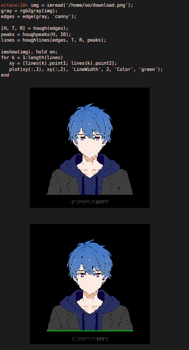 

## 3.11 
Use the Matlab Companion (Svoboda et al., 2008] to develop solutions to additional exercises and practical problems provided there. Implement your solutions using Matlab or other suitable programming languages.

Use Matlab || Octave

Full Code Main 8 : 
```matlab
img = imread('/home/oo/download.png');
gray = rgb2gray(img);
edges = edge(gray, 'canny');
[H, theta, rho] = hough(edges);
peaks = houghpeaks(H, 10, 'threshold', ceil(0.3 * max(H(:))));
lines = houghlines(edges, theta, rho, peaks);
imshow(img), hold on;
for k = 1:length(lines)
   xy = [lines(k).point1; lines(k).point2];
   plot(xy(:,1), xy(:,2), 'LineWidth', 2, 'Color', 'green');
end
```

Atau bisa menggunakan 

```python
import cv2
import numpy as np
import matplotlib.pyplot as plt

img = cv2.imread(r'E:\Back Up E\Tugas Kuliah Semester 4\PCD\Tugas 2\images.jpg')
gray = cv2.cvtColor(img, cv2.COLOR_BGR2GRAY)
edges = cv2.Canny(gray, 50, 150)

lines = cv2.HoughLinesP(edges, 1, np.pi/180, threshold=100, minLineLength=50, maxLineGap=10)

for line in lines:
    x1, y1, x2, y2 = line[0]
    cv2.line(img, (x1, y1), (x2, y2), (0, 255, 0), 2)

plt.imshow(cv2.cvtColor(img, cv2.COLOR_BGR2RGB))
plt.title('Detected Lines')
plt.axis('off')
plt.show()
```


Output : 
- Using Matlab
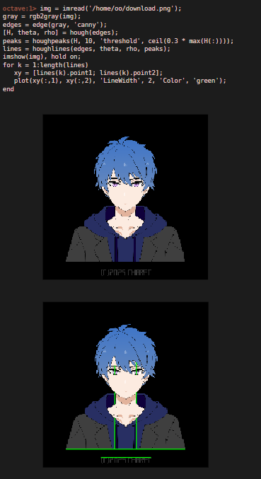 
- Using Python
 